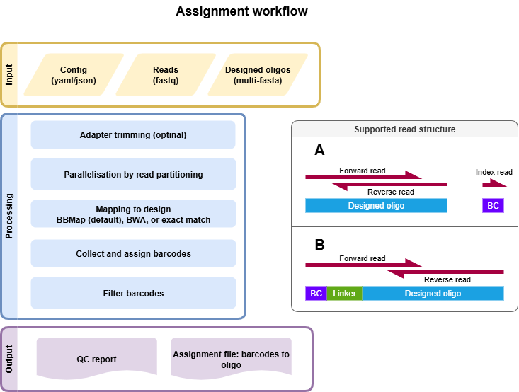

.. _Assignment:

=====================
Assignment
=====================

Input Files
===============

Fastq Files
-----------
- 2-3 Fastq files from library association sequencing
- Candidate regulatory sequence (CRS) sequencing, forward and reverse read (paired-end)
- (optional) Index read with barcode. The barcode (BC) can also be present at the beginning of the forward read followed by a linker.

Design File
-----------
Multi-FASTA file of CRS sequences with unique headers describing each tested sequence.

Example file:

.. code-block:: text

    >CRS1
    GACGGGAACGTTTGAGCGAGATCGAGGATAGGAGGAGCGGA
    >CRS2
    GGGCTCTCTTATATTAAGGGGGTGTGTGAACGCTCGCGATT
    >CRS3
    GGCGCGCTTTTTCGAAGAAACCCGCCGGAGAATATAAGGGA
    >CRS4
    TTAGACCGCCCTTTACCCCGAGAAAACTCAGCTACACACTC

.. note:: 

    Headers of the design file must be unique (before any space) and should not contain duplicated sequences (forward and antisense). Headers must follow this naming rules:

    - The first character must be one of: :code:`0-9`, :code:`A-Z`, :code:`a-z`, or :code:`! # $ % & + . / : ; ? @ ^ _ | ~ -` (notably, :code:`*` and :code:`=` are NOT allowed as the first character)
    - Subsequent characters may include all of the above, plus :code:`*` and :code:`=`
    - This prevents headers from starting with :code:`*` or :code:`=`, which may be reserved or problematic in downstream tools.

Config File
-----------
Multiple mapping strategies are implemented to find the corresponding CRS sequence for each read. The mapping strategy can be chosen in the config file (bbmap, bwa mem, or exact matches). The config file also defines the filtering of the mapping results and is a YAML file.

Example of an assignment file using bbmap and the standard filtering (we recommend using bbmap as the default):

.. literalinclude:: ../../config/example_assignment_bbmap.yaml
   :language: yaml

Example of an assignment file using bwa and the standard filtering:

.. literalinclude:: ../../config/example_assignment_bwa.yaml
   :language: yaml

Example of an assignment file using exact matches with non-default filtering of barcodes:

.. literalinclude:: ../../config/example_assignment_exact_lazy.yaml
   :language: yaml

Example of an assignment file using exact matches and read 1 with BC, linker, and oligo (no separate BC index read):

.. literalinclude:: ../../config/example_assignment_exact_linker.yaml
   :language: yaml

If you want to use the strand sensitivity option (e.g., testing enhancers in both directions), you can add the following to the config file: :code:`strand_sensitive: {enable: true}`. Otherwise, MPRAsnakeflow will give you an error because it cannot handle the same sequences in both sense and antisense directions. This is an issue with the mappers because they do not consider the strand and will always call your read ambiguous due to multiple matches.

Snakemake
============================

Options
---------------

With :code:`--help` or :code:`-h`, you can see the help message.

Mandatory arguments:
  :\-\-cores:                 
    Use at most N CPU cores/jobs in parallel. If N is omitted or 'all', the limit is set to the number of available CPU cores. In the case of cluster/cloud execution, this argument sets the number of total cores used over all jobs (made available to rules via workflow.cores). (default: None)
  :\-\-configfile:
    Specify or overwrite the config file of the workflow (see the docs). Values specified in JSON or YAML format are available in the global config dictionary inside the workflow. Multiple files overwrite each other in the given order. Missing keys in previous config files are extended by following config files. (default: None)
  :\-\-sdm:             
    **Required to run MPRAsnakeflow.** : :code:`--sdm conda` or :code:`--sdm apptainer conda`. Uses the defined conda environment per rule. We highly recommend using apptainer, where we build a predefined Docker container with all software installed within it. :code:`--sdm conda` installs the conda environments during the first execution of the workflow. If this flag is not set, the conda/apptainer directive is ignored. (default: False)

Recommended arguments:
  :\-\-snakefile:             
    You should not need to specify this. By default, Snakemake will search for 'Snakefile', 'snakefile', 'workflow/Snakefile', or 'workflow/snakefile' beneath the current working directory, in this order. Only if you definitely want a different layout, you need to use this parameter. This is very useful when you want to have the results in a different folder than MPRAsnakeflow is in. (default: None)

Useful arguments:
  :-n:                      
    Do not execute anything, and display what would be done. If you have a very large workflow, use --dry-run --quiet to just print a summary of the DAG of jobs. (default: False)
  :\-\-touch, -t:             
    Touch output files (mark them up to date without really changing them) instead of running their commands. This is used to pretend that the rules were executed, in order to fool future invocations of Snakemake. Fails if a file does not yet exist. Note that this will only touch files that would otherwise be recreated by Snakemake (e.g., because their input files are newer). For enforcing a touch, combine this with --force, --forceall, or --forcerun. Note, however, that you lose the provenance information when the files have been created in reality. Hence, this should be used only as a last resort. (default: False)

Rules
-------------

Rules run by Snakemake in the assignment utility:

- **all**: General all rule to get all output files for MPRAsnakeflow (default rule).
- **all_assignments**: All rule to get all output files for the assignments workflow.
- **all_qc_report**: All rule to generate QC reports.
- **assignment_attach_idx**: Extract the index sequence and add it to the header.
- **assignment_check_design**: Check if the design file is correct and no duplicated sequences are present (FW and reverse). Also check if no duplicated headers and no illegal characters in header.
- **assignment_collect**: Collect mapped reads.
- **assignment_collectBCs**: Get the barcodes.
- **assignment_fastq_split**: Split the fastq files into n files for parallelisation.
- **assignment_filter**: Filter the barcodes file based on the config given in the config-file. Results are here: :code:`results/assignment/<assignment_name>/assignment_barcodes.<config_name>.tsv.gz`.
- **assignment_flagstat**: Run samtools flagstat
- **assignment_hybridFWDRead_get_reads_by_cutadapt**: Get the barcode and read from the FWD read using cutadapt. Uses the paired end mode of cutadapt to write the FWD and BC read.
- **assignment_hybridFWDRead_get_reads_by_length**: Get the barcode and read from the FW read using fixed length
- **assignment_idx_bam**: Index the BAM file
- **assignment_mapping_bbmap**: Map the reads to the reference and sort unsing bwa mem.
- **assignment_mapping_bbmap_getBCs**: Get the barcodes with the bbmap routine.
- **assignment_mapping_bwa**: Map the reads to the reference and sort unsing bwa mem.
- **assignment_mapping_bwa_getBCs**: Get the barcodes with the bwa mem routine.
- **assignment_mapping_bwa_getBCs_additional_filter**: Get the barcodes with a python script to rescue alignments with 0 mapping quality according to bwa.
- **assignment_mapping_bwa_ref**: Create mapping reference for BWA from design file.
- **assignment_mapping_exact**: Map the reads to the reference and sort using exact match.
- **assignment_mapping_exact_reference**: Create reference to map the exact design
- **assignment_merge**: Merge the FW,REV and BC fastq files into one. Extract the index sequence and add it to the header.
- **assignment_preprocessing_adapter_remove**: Remove adapter sequence from the reads (3' or 5'). Uses cutadapt to trim adapters based on the primer direction.
- **assignment_statistic_assignedCounts**: Statistic of the assigned counts.
- **assignment_statistic_assignment**: Statistic of the filtered assignment.
- **assignment_statistic_quality_metric**: Quality metrics of the assignment run
- **assignment_statistic_totalCounts**: Statistic of the total (unfiltered counts).
- **qc_report_assoc**: This rule generates the QC report for the assignment.

Output
==========

The output can be found in the folder defined by the option :code:`results/assignment/`. It is structured in folders of the assignment name, defined in the config file. It is structured in folders of the assignment name as follows:

Files
-------------
Once the pipeline is finished running, all the output files can be seen in the results folder. This pipeline also generates a QC report. 

For more details, refer to the `HTML QC report <https://kircherlab.github.io/mprasnakeflow/assignment.html>`_.

File tree of the result folder (names in :code:`< >` can be specified in the config file):

.. code-block:: text

    ├── assignment
    └── <assignment_name>
        ├── BCs
        ├── aligned_merged_reads.bam
        ├── aligned_merged_reads.bam.bai
        ├── assignment_barcodes.<config_name>.tsv.gz
        ├── assignment_barcodes_with_ambiguous.<config_name>.tsv.gz
        ├── barcodes_incl_other.tsv.gz
        ├── bbmap
        ├── design_check.done
        ├── design_check.err
        ├── fastq
        │   └── splits
        ├── qc_report.<config_name>.html
        ├── reference
        │   └── reference.fa
        └── statistic
            ├── assigned_counts.<config_name>.tsv
            ├── assignment
            │   └── bam_stats.txt
            ├── assignment.<config_name>.png
            ├── assignment.<config_name>.tsv.gz
            └── total_counts.tsv

Key output files:

- **qc_report.<config_name>.html**: QC report of the assignment.
- **total_counts.tsv**: Raw statistics of barcodes mapped to oligos.
- **assigned_counts.<config_name>.tsv**: Statistics of barcodes mapped to oligos after filtering.
- **assignment.<config_name>.tsv.gz**: Average/median support of barcodes per oligo.
- **reference.fa**: Design file.
- **aligned_merged_reads.bam**: Sorted BAM file for oligo alignment.
- **assignment_barcodes.<config_name>.tsv.gz**: Mapping file of barcodes to sequences.
