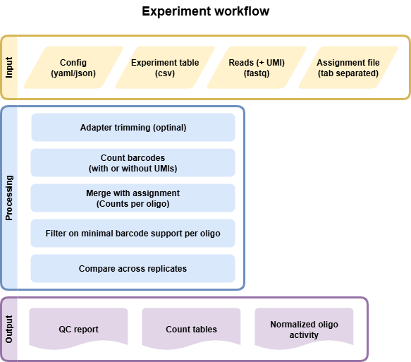

.. _Experiment:

=====================
Experiment (Count)
=====================

Input files
===============

Experiment File
---------------
Comma separated file (CSV) that assigns all fastq files present in a directory to a condidtion and replicate. Each line represents an experiment, which will all be processed in parallel

.. code-block:: text

    Condition,Replicate,DNA_BC_F,DNA_UMI,DNA_BC_R,RNA_BC_F,RNA_UMI,RNA_BC_R
    Condidtion1,1,C1R1_DNA_barcode_F.fastq.gz,C1R1_DNA_barcode_UMI.fastq.gz,C1R1_DNA_barcode_R.fastq.gz,C1R1_RNA_barcode_F.fastq.gz,C1R1_RNA_barcode_UMI.fastq.gz,C1R1_RNA_barcode_R.fastq.gz
    Condidtion1,2,C1R2_DNA_barcode_F.fastq.gz,C1R2_DNA_barcode_UMI.fastq.gz,C1R2_DNA_barcode_R.fastq.gz,C1R2_RNA_barcode_F.fastq.gz,C1R2_RNA_barcode_UMI.fastq.gz,C1R2_RNA_barcode_R.fastq.gz
    Condidtion1,3,C1R3_DNA_barcode_F.fastq.gz,C1R3_DNA_barcode_UMI.fastq.gz,C1R3_DNA_barcode_R.fastq.gz,C1R3_RNA_barcode_F.fastq.gz,C1R3_RNA_barcode_UMI.fastq.gz,C1R3_RNA_barcode_R.fastq.gz
    Condidtion2,1,C2R1_DNA_barcode_F.fastq.gz,C2R1_DNA_barcode_UMI.fastq.gz,C2R1_DNA_barcode_R.fastq.gz,C2R1_RNA_barcode_F.fastq.gz,C2R1_RNA_barcode_UMI.fastq.gz,C2R1_RNA_barcode_R.fastq.gz
    Condidtion2,2,C2R2_DNA_barcode_F.fastq.gz,C2R2_DNA_barcode_UMI.fastq.gz,C2R2_DNA_barcode_R.fastq.gz,C2R2_RNA_barcode_F.fastq.gz,C2R2_RNA_barcode_UMI.fastq.gz,C2R2_RNA_barcode_R.fastq.gz
    Condidtion2,3,C2R3_DNA_barcode_F.fastq.gz,C2R3_DNA_barcode_UMI.fastq.gz,C2R3_DNA_barcode_R.fastq.gz,C2R3_RNA_barcode_F.fastq.gz,C2R3_RNA_barcode_UMI.fastq.gz,C2R3_RNA_barcode_R.fastq.gz
    

We allow different flavours of experiment files because sometimes no UMI exists or only a FW read is used. Different options are:
    * :code:`Condition,Replicate,DNA_BC_F,DNA_UMI,DNA_BC_R,RNA_BC_F,RNA_UMI,RNA_BC_R`
    * :code:`Condition,Replicate,DNA_BC_F,DNA_BC_R,RNA_BC_F,RNA_BC_R`
    * :code:`Condition,Replicate,DNA_BC_F,RNA_BC_F`

It is possible to use only one count experiment per condition across replicates (DNA or RNA, but usually only DNA can make sense). E.g. if you expect the same number of inserts/transfections across replicates. If you use the same files for :code:`DNA` or :code:`RNA` MPRAsnakeflow will only run the first replicate and use the counts for all replicates later.

Assignment File or configuration
--------------------------------
Tab separated gzipped file with barcode mapped to sequence. Can be generated using the :ref:`Assignment` workflow. Config file must be configured similar to this:

.. code-block:: yaml

    example_assignment:
        type: file
        value: /path/to/your/file.tsv.gz

Example assignment file:

.. code-block:: text

    ATGCGT  CRS1
    GTCGA   CRS2
    CCGTT   CRS3
    CCCCT   CRS4

Another option would be referring to an assignment defined in a config file.

.. code-block:: yaml

    example_assignment:
        type: config
        value: example_config

Label File (Optional)
---------------------
Tab separated file (TSV) of desired labels for each tested sequence

Example file:

.. code-block:: text

    CRS1  Positive_Control
    CRS2  Negative_Control
    CRS3  Test
    CRS4  Positive_Control

.. note:: If you provide a label file, the first column of the label file must exactly match the FASTA file or the files will not merge properly in the pipeline.

snakemake
============================
 
Options
---------------

With :code:`--help` or :code:`-h` you can see the help message.

Mandatory arguments:
  :\-\-cores:                 
    Use at most N CPU cores/jobs in parallel. If N is omitted or 'all', the limit is set to the number of available CPU cores. In case of cluster/cloud execution, this argument sets the number of total cores used over all jobs (made available to rules via workflow.cores).(default: None)
  :\-\-configfile:
    Specify or overwrite the config file of the workflow (see the docs). Values specified in JSON or YAML format are available in the global config dictionary inside the workflow. Multiple files overwrite each other in the given order. Thereby missing keys in previous config files are extended by following configfiles. Note that this order also includes a config file defined in the workflow definition itself (which will come first). (default: None)
  :\-\-sdm:             
    **Required to run MPRAsnakeflow.** : :code:`--sdm conda` or :code:`--sdm apptainer conda` Uses the defined conda environment per rule. We highly recommend to use apptainer where we build a predefined docker container with all software installewd within it. :code:`--sdm conda` the conda envs will be installed by the first excecution of the workflow. If this flag is not set, the conda/apptainer directive is ignored. (default: False)
Recommended arguments:
  :\-\-snakefile:             
    You should not need to specify this. By default, Snakemake will search for 'Snakefile', 'snakefile', 'workflow/Snakefile','workflow/snakefile' beneath the current working directory, in this order. Only if you definitely want a different layout, you need to use this parameter. This is very usefull when you want to have the results in a different folder than MPRAsnakeflow is in. (default: None)
Usefull arguments:
  :-n:                      
    Do not execute anything, and display what would be done. If you have a very large workflow, use --dry-run --quiet to just print a summary of the DAG of jobs. (default: False)                                                       
  :\-\-touch, -t:             
    Touch output files (mark them up to date without really changing them) instead of running their commands. This is used to pretend that the rules were executed, in order to fool future invocations of snakemake. Fails if a file does not yet exist. Note that this will only touch files that would otherwise be recreated by Snakemake (e.g. because their input files are newer). For enforcing a touch, combine this with --force, --forceall, or --forcerun. Note however that you loose the provenance information when the files have been created in realitiy. Hence, this should be used only as a last resort. (default: False)

Rules
---------

Rules run by snakemake in the experiment workflow. Some rules will be run only if certain options

- **all**: General all rule to get all output files for MPRAsnakeflow (default rule).
- **all_bc_overlap_statistic**: All rule to get BC overlap statistic of the experiment workflow.
- **all_experiments**: All rule to get all output files for the experiment workflow.
- **all_experiments_assignments**: All rule to get assigned counts for experiment workflow.
- **all_experiments_assignments_statistic**: All rule to get assigned counts statistic for experiment workflow.
- **all_experiments_counts_stats**: All rule to get count statistics of the experiment workflow.
- **all_qc_report**: All rule to generate QC reports.
- **all_stats_BCNucleotideComposition**: All rule to get BC nucleotide composition of the experiment workflow.
- **experiment_assigned_counts_assignBarcodes**: Assign RNA and DNA barcodes seperately to make the statistic for assigned
- **experiment_assigned_counts_combine_replicates**: Combine replicates of master table by summing counts up and using also the average.
- **experiment_assigned_counts_combine_replicates_barcode_output**: Combine replictes of assigned barcode counts into one file.
- **experiment_assigned_counts_copy_final_all_files**: Will copy final files to the main folder so that it is clear which files to use.
- **experiment_assigned_counts_copy_final_thresh_files**: Will copy final files to the main folder so that it is clear which files to use.
- **experiment_assigned_counts_createAssignmentPickleFile**: Create a pickle file for assigned counts.
- **experiment_assigned_counts_dna_rna_merge**: Assign merged RNA/DNA barcodes. Filter BC depending on the min_counts option.
- **experiment_assigned_counts_filterAssignment**: Use only unique assignments and do sampling if needed.
- **experiment_assigned_counts_make_master_tables**: Final master table with all replicates combined. With and without threshold.
- **experiment_counts_demultiplex_BAM_umi**: Demultiplexing the data and create demultiplexed bam files per condition.
- **experiment_counts_demultiplex_aggregate**: Aggregate the demultiplexed bam files per condition.
- **experiment_counts_demultiplex_create_index**: Create the demultiplexing index file for the experiment.
- **experiment_counts_demultiplex_mergeTrimReads_BAM_umi**: Merge and trim reads in demultiplexed bam files.
- **experiment_counts_dna_rna_merge_counts**: Merge DNA and RNA counts together.
- **experiment_counts_filter_counts**: Filter the counts to BCs only of the correct length (defined in the config file)
- **experiment_counts_final_counts**: Counting BCs. Discarding PCR duplicates (taking BCxUMI only one time)
- **experiment_counts_final_counts_sampler**: Creates full + new distribution DNA files
- **experiment_counts_noUMI_create_BAM**: Create a BAM file from FASTQ input, merge FW and REV read and save UMI in XI flag.
- **experiment_counts_noUMI_raw_counts**: Counting BCsxUMIs from the BAM files.
- **experiment_counts_onlyFWDUMI_raw_counts**: Getting the BCs and UMIs from the reads using fixed length.
- **experiment_counts_onlyFWD_raw_counts**: Getting the BCs from the reads using fixed length.
- **experiment_counts_umi_create_BAM**: Create a BAM file from FASTQ input, merge FW and REV read and save UMI in XI flag.
- **experiment_counts_umi_raw_counts**: Counting BCsxUMIs from the BAM files.
- **experiment_preprocessing_trim_reads**: Getting the BCs from the reads using cutadapt.
- **experiment_statistic_assigned_counts_combine_BC_assignment_stats**: Combined assinged counts statistic per condition (DNA and aRNA not merged)
- **experiment_statistic_assigned_counts_combine_BC_assignment_stats_helper**: Combine assigned counts statistic per replicate and modality (DNA and RNA not merged)
- **experiment_statistic_assigned_counts_combine_stats_dna_rna_merge**: Combine assigned counts statistic per replicate (DNA and RNA merged)
- **experiment_statistic_assigned_counts_combine_stats_dna_rna_merge_all**: Combine assigned counts statistic per condition (DNA and RNA merged)
- **experiment_statistic_bc_overlap_combine_assigned_counts**: Combine overlap BC and count statistic into one file (assigned counts).
- **experiment_statistic_bc_overlap_combine_counts**: Combine overlap BC and count statistic into one file (raw counts).
- **experiment_statistic_bc_overlap_run**: Get overlap of counts and barcodes between replicates.
- **experiment_statistic_correlation_bc_counts**: Calculate the correlation of the raw counts for each condition across replicates.
- **experiment_statistic_correlation_bc_counts_hist**: Generate histogram and boxplots of the raw counts for each condition across replicates.
- **experiment_statistic_correlation_calculate**: Calculate the correlation of oligos for each condition across replicates.
- **experiment_statistic_correlation_combine_bc_assigned**: Combine the correlation of the assigned counts for each condition across replicates into one table.
- **experiment_statistic_correlation_combine_bc_raw**: Combine the correlation of the raw counts for each condition across replicates into one table.
- **experiment_statistic_correlation_combine_oligo**: Combine the correlation of oligos for each condition across replicates into one table.
- **experiment_statistic_correlation_hist_box_plots**: Generate histogram and boxplots of the oligos for each condition across replicates.
- **experiment_statistic_counts_BC_in_RNA_DNA**: Count the number of barcodes shared between RNA and DNA per condition and replicate.
- **experiment_statistic_counts_BC_in_RNA_DNA_merge**: Merge the shared barcodes statistic of all replicates and conditions into one table.
- **experiment_statistic_counts_barcode_base_composition**: Count the nucleotide composition of the barcodes per condition, replicate and DNA/RNA.
- **experiment_statistic_counts_final**: Combine the final count statistic of all replicates and conditions into one table.
- **experiment_statistic_counts_frequent_umis**: Count the 10 most frequent UMIs per condition, replicate and DNA/RNA.
- **experiment_statistic_counts_stats_merge**: Merge the count statistic of all replicates and conditions into one table.
- **experiment_statistic_counts_table**: Count statistic of barcodes and UMIs per condition, replicate and DNA/RNA.
- **experiment_statistic_quality_metric**: Quality metrics of the assignment run
- **qc_report_count**: This rule generates the QC report for the count data.

  
Output
==========

The output can be found in the folder defined by the option :code:`results/experiments/`. It is structured in folders of the experiment name, defined in the config file. It is structured in folders of the experiemnt name as follows:

Files
-------------
Once the pipline is finished running then all the output files can be seen in the results folder. This pipline also generates a qc report. 
For more details, refer to the `HTML QC report <https://kircherlab.github.io/mprasnakeflow/experiment.html>`_.

File tree of the result folder (names in :code:`< >` can be specified in the config file). Might be slightly different when using wih/without UMI or with/without paired reads:

.. code-block:: text

    experiments
    └── <experiment_name>
        ├── assigned_counts
        │   └── <assignment_name>
        │       ├── <condition>.<replicate>.<modality>.final_counts.config.<config_name>.tsv.gz
        │       ├── <condition>.<replicate>.merged.config.<config_name>.tsv.gz
        │       └── <config_name>
        │           ├── <condition>.<replicate>.barcode_assigned_counts.tsv.gz
        │           ├── <condition>.<replicate>.barcodesRemoved_assigned_counts.tsv.gz
        │           ├── <condition>.<replicate>.merged_assigned_counts.tsv.gz
        │           ├── <condition>.<replicate>.merged.combined.tsv.gz
        │           ├── <condition>.<replicate>.merged.tsv.gz
        │           ├── <condition>.<replicate>.merged_barcode_assigned_counts.tsv.gz
        │           ├── <condition>.allreps_minThreshold.merged.combined.tsv.gz
        │           ├── <condition>.allreps_minThreshold.merged.tsv.gz
        │           └── <condition>.allreps_minThreshold.merged_barcode_assigned_counts.tsv.gz
        ├── assignment
        │   └── <assignment_name>.tsv.gz
        ├── counts
        │   ├── <condition>.<replicate>.<modality>.filtered_counts.tsv.gz
        │   ├── <condition>.<replicate>.<modality>.final_counts.tsv.gz
        │   ├── <condition>.<replicate>.merged.<config_name>.tsv.gz
        │   ├── useUMI.<condition>.<replicate>.<modality>.bam
        │   └── useUMI.<condition>.<replicate>.<modality>.raw_counts.tsv.gz
        ├── qc_metrics.<condition>.<assignment_name>.<config_name>.json
        ├── qc_report.<condition>.<assignment_name>.<config_name>.html
        ├── reporter_experiment.barcode.<condition>.<assignment_name>.<config_name>.all.tsv.gz
        ├── reporter_experiment.barcode.<condition>.<assignment_name>.<config_name>.min_oligo_threshold_10.tsv.gz
        ├── reporter_experiment.oligo.<condition>.<assignment_name>.<config_name>.all.tsv.gz
        ├── reporter_experiment.oligo.<condition>.<assignment_name>.<config_name>.min_oligo_threshold_10.tsv.gz
        └── statistic
            ├── assigned_counts
            │   └── <assignment_name>
            │       └── <config_name>
            │           ├── <condition>.<modality>.pairwise.minThreshold.png
            │           ├── <condition>.<modality>.pairwise.png
            │           ├── <condition>.Ratio.pairwise.minThreshold.png
            │           ├── <condition>.Ratio.pairwise.png
            │           ├── <condition>.average_allreps.merged.tsv.gz
            │           ├── <condition>.barcodesPerInsert.png
            │           ├── <condition>.dna_vs_rna.png
            │           ├── <condition>.dna_vs_rna_minThreshold.png
            │           ├── <condition>.group_barcodesPerInsert_box.png
            │           └── <condition>.group_barcodesPerInsert_box_minThreshold.png
            ├── barcode
            │   ├── assigned_counts
            │   │   └── <assignment_name>
            │   │       ├── <condition>.<config_name>.<modality>.perBarcode.png
            │   │       ├── <condition>.<config_name>.barcode.<modality>.pairwise.png
            │   │       └── <condition>.<config_name>.barcode.Ratio.pairwise.png
            │   └── counts
            │       ├── <condition>.<config_name>.<modality>.perBarcode.png
            │       ├── <condition>.<config_name>.barcode.<modality>.pairwise.png
            │       └── <condition>.<config_name>.barcode.Ratio.pairwise.png
            ├── bc_overlap.assigned_counts.<config_name>.<assignment_name>.tsv
            ├── bc_overlap.counts.<config_name>.tsv
            ├── counts
            │   └── BCNucleotideComposition.<condition>.<replicate>.<modality>.tsv.gz
            ├── counts.filtered.tsv
            ├── counts.freqUMIs.<condition>.<replicate>.<modality>.txt
            ├── counts.raw.tsv
            ├── statistic_assigned_bc_correlation_merged.<assignment_name>.<config_name>.tsv
            ├── statistic_assigned_counts_merged.<assignment_name>.<config_name>.tsv
            ├── statistic_assigned_counts_single.<assignment_name>.<config_name>.tsv
            ├── statistic_bc_correlation_merged.<config_name>.tsv
            └── statistic_oligo_correlation_merged.<assignment_name>.<config_name>.tsv

Key output files:

- **qc_report.<config_name>.html**: QC report of the experimemt.
- **reporter_experiment.barcode.<condition>.<assignment_name>.<config_name>.all.tsv.gz**: Reporter experiment barcode count file containing barcode, oligo ID, and then columns for DNA and RNA counts for each replicate. If not observed the entry is empty.
- **reporter_experiment.barcode.<condition>.<assignment_name>.<config_name>.min_oligo_threshold_10.tsv.gz**: Same as abive but just for oligos that have at least 10 barcodes.
- **reporter_experiment.oligo.<condition>.<assignment_name>.<config_name>.all.tsv.gz**: Reporter experiment count file aggegated to oligo level. Containing replicate name, oligo ID, dna counts, rna counts, dna normalized (CPM), rna normalized (CPM), log2FoldChange, and number of barcodes.
- **reporter_experiment.oligo.<condition>.<assignment_name>.<config_name>.min_oligo_threshold_10.tsv.gz**: Same as above but just for oligos that have at least 10 barcodes.
